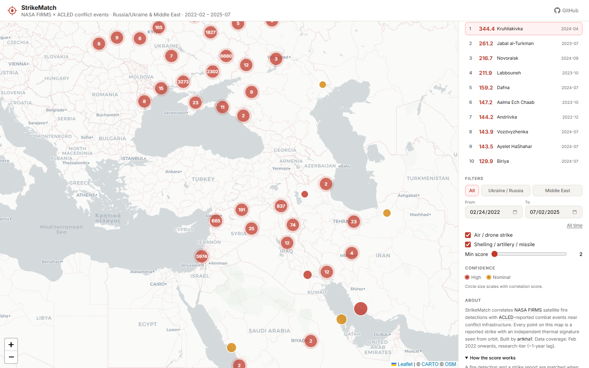
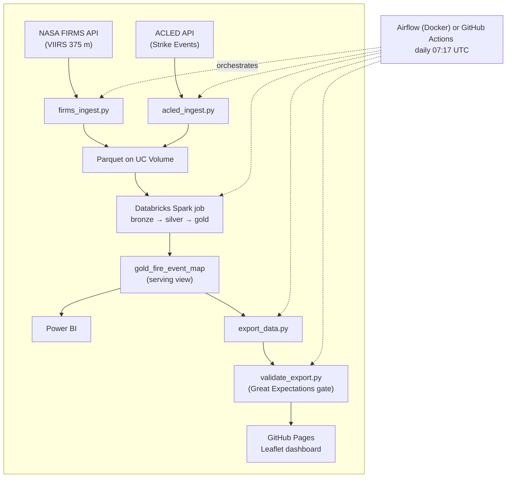

# StrikeMatch

**Satellite-confirmed strike events.** StrikeMatch correlates [NASA FIRMS](https://firms.modaps.eosdis.nasa.gov/) satellite fire/thermal-anomaly detections with [ACLED](https://acleddata.com/)-reported combat events across two theaters — **Russia/Ukraine** and the **Middle East** — and serves the confirmed matches on an interactive map. Every point is a reported strike with an independent thermal signature seen from orbit.

**▶ [Live dashboard](https://artkha1.github.io/StrikeMatch/)**

[](https://github.com/artkha1/StrikeMatch/actions/workflows/ci.yml)
[](https://github.com/artkha1/StrikeMatch/actions/workflows/data-quality.yml)
[](https://github.com/artkha1/StrikeMatch/actions/workflows/pages.yml)



## How it works



1. **Ingest** — `pipeline/firms_ingest.py` pulls VIIRS I-Band 375 m detections (NRT for recent dates, SP archive otherwise) for the two theaters; `pipeline/acled_ingest.py` pulls ACLED *Air/drone strike* and *Shelling/artillery/missile attack* events with site-precise coordinates (`geo_precision` 1–2). Both write Parquet straight to a Databricks Unity Catalog Volume.
2. **Transform** — a serverless Databricks job (`pipeline/spark_pipeline_databricks.py`) MERGEs bronze Delta tables, deduplicates overlapping satellite passes (grid-bin + Haversine anti-join, 1 km / 6 h), and computes the scored FIRMS × ACLED correlation join.
3. **Serve** — a gold view keeps only confirmed matches (best-scoring fire per ACLED event); `pipeline/export_data.py` exports it to compact columnar JSON, a Great Expectations gate validates it, and Airflow/GitHub Actions commits it for GitHub Pages.

### Match definition & scoring

A fire detection matches a strike report when they are within **10 km** and the event date falls within **[fire − 48 h, fire + 6 h]** (the 6 h absorbs local-date vs UTC skew). Each match gets a 5-factor multiplicative score:

```
score = (frp/300) × conf × (sources/3) × √(1 − d/10 km) × (1 − |Δt|/54 h) × 1000
```

| Factor | Meaning | Rationale |
|---|---|---|
| `frp/300` (cap 1) | fire radiative power | 300 MW ≈ an extreme fire |
| `conf` | 1.0 high / 0.8 nominal | VIIRS detection confidence |
| `sources/3` (cap 1) | independent outlets reporting | conflict reporting is 1–4 outlets |
| `√(1 − d/10 km)` | proximity decay | concave; 0 at the 10 km boundary |
| `1 − \|Δt\|/54 h` | temporal decay | linear over the match window |

Displayed scores ≥ **20** are strong confirmations; the archival threshold is **2**.

### Validation benchmarks

The scoring is calibrated against publicly documented strikes:

| Event | Date | Score | Distance | FRP |
|---|---|---|---|---|
| Proletarsk oil depot (Rostov) | 2024-08-18 | **72.5** | 4.4 km | 43.4 MW |
| Dyagilevo airfield (Ryazan, "Spiderweb") | 2025-06-01 | 3.2 | 6.1 km | 5.5 MW |
| Lyudinovo oil terminal (Kaluga) | 2025-01-17 | 3.2 | 1.3 km | 3.4 MW |

These three events are enforced as **ground-truth checks** in the data-quality gate — any scoring change that loses them fails the pipeline before publish.

## Repository layout

```
pipeline/                     ingest, Spark job, export, data-quality gate
  firms_ingest.py             FIRMS VIIRS → Parquet → UC Volume
  acled_ingest.py             ACLED strikes → Parquet → UC Volume
  spark_pipeline_databricks.py  bronze → silver → gold (runs on Databricks serverless)
  export_data.py              gold view → dashboard/data/*.json
  validate_export.py          Great Expectations gate (blocks bad publishes)
dags/fire_event_pipeline.py   Airflow DAG (daily 07:17 UTC)
dashboard/index.html          Leaflet dashboard (static, GitHub Pages)
dashboard/data/               exported events + metadata (auto-committed daily)
tests/                        unit + Spark-transform + data-quality tests
.github/workflows/            ci.yml, data-quality.yml, pages.yml, pipeline.yml
```

## Running it yourself

Prerequisites: Python 3.10+, a free [FIRMS MAP key](https://firms.modaps.eosdis.nasa.gov/api/), [ACLED](https://acleddata.com/) credentials (Research tier - data trails real-time by ~1 year), and a Databricks workspace (Free Edition works) with a SQL warehouse.

Two scheduling options, pick one:

### Option A: GitHub Actions (recommended)

No always-on machine needed. GitHub's servers run the pipeline daily at 07:17 UTC.

1. Fork or push this repo to GitHub.
2. Go to **Settings → Secrets and variables → Actions** and add each value from `.env.example` as a repository secret (`FIRMS_MAP_KEY`, `ACLED_USERNAME`, `ACLED_PASSWORD`, `DATABRICKS_HOST`, `DATABRICKS_TOKEN`, `DATABRICKS_VOLUME_PATH`, `DATABRICKS_JOB_ID`, `DATABRICKS_SQL_HTTP_PATH`).
3. The `pipeline.yml` workflow runs automatically, or trigger it manually from the **Actions** tab.

Failure notifications come from GitHub's built-in email alerts (no SMTP config required).

### Option B: Airflow on Docker (local)

Richer UI with a DAG graph, task logs, retries, and manual backfill support, but requires the machine to stay on.

```bash
cp .env.example .env          # fill in FIRMS, ACLED, Databricks, and SMTP credentials
docker compose up -d          # Airflow at http://localhost:8080 (admin/admin)
```

The `fire_event_pipeline` DAG runs daily at 07:17 UTC: ingest (parallel) → Databricks job → validate → export → data-quality gate → git push.

---

Manual/backfill runs (both options):

```bash
python pipeline/firms_ingest.py --start 2022-02-24 --end 2022-02-28
python pipeline/acled_ingest.py --start 2022-02-24 --end 2022-02-28
# trigger the Databricks job, then:
python pipeline/export_data.py
python pipeline/validate_export.py
```

### Tests & data quality

```bash
pip install -r requirements-dev.txt
ruff check .
pytest -m "not spark"         # pure-logic unit tests
pytest -m spark               # transform tests on a local SparkSession (needs Java)
python pipeline/validate_export.py   # GE suite + ground-truth checks on the export
```

CI runs lint + both test suites on every push; a separate workflow re-validates the data on every dashboard export commit.

## Limitations

- **ACLED lag** — Research-tier access publishes with a ~1-year delay, so the map trails real-time by about a year.
- **Clouds** — VIIRS cannot see through cloud cover; several documented strikes (Tuapse Jan 2024, Kazan Jan 2025, Kstovo Jan 2025, Kremenchuk oil refinery strikes) have no thermal match. Absence of a fire is not absence of a strike.
- **Geolocation** — ACLED `geo_precision` 2 places events at the nearest admin center; the 10 km gate absorbs most but not all of that error.
- **Small fires** — detections under 1 MW FRP are treated as sub-thermal noise and excluded.

## Stack

- Python
- pandas
- PySpark on Databricks serverless (Delta Lake medallion, Unity Catalog)
- Apache Airflow 2.9 (Docker Compose)
- Great Expectations
- pytest + ruff + GitHub Actions
- Leaflet + MarkerCluster on GitHub Pages
- Power BI over a Databricks SQL warehouse
